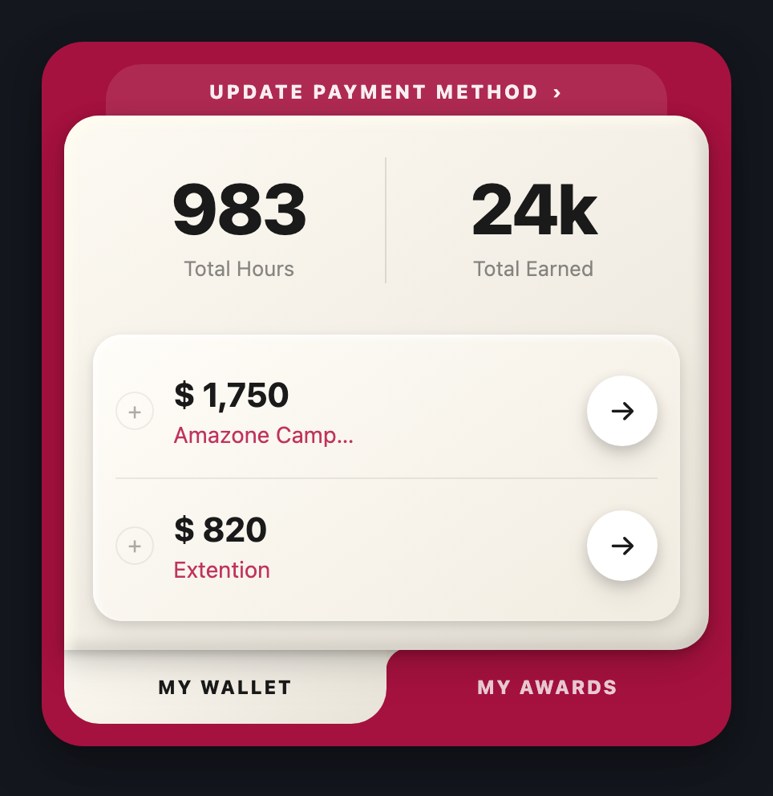
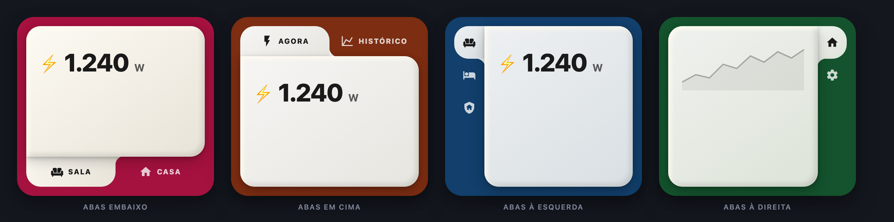
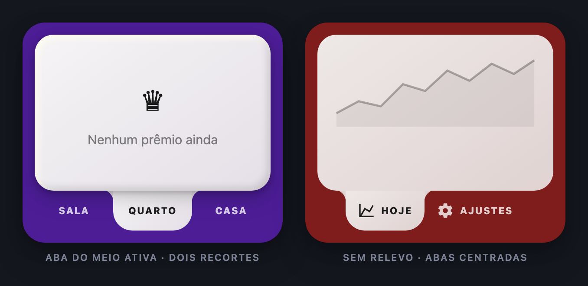

<!-- MW-BRAND:BEGIN — gerado por IA/tools/mw-brand.sh · não editar à mão -->
<p align="center">
  <a href="https://github.com/visaodeempresa">
    
  </a>
  <br>
  <sub><b>Visão de Empresa</b> · componente de Home Assistant por MAYCON WILLIAN OLIVEIRA</sub>
</p>
<!-- MW-BRAND:END -->

# MW HA Tab Card

Card Lovelace `custom:mw-tab-card` — **abas de verdade no Home Assistant**:
cada aba guarda uma pilha de cards (qualquer card, inclusive os outros cards
MW e os de terceiros).

<p align="center">
  
</p>

O desenho é o painel de papel do
[MW Power Button Card](https://github.com/visaodeempresa/mw-ha-power-button-card):
mesma paleta de **papel encardido** (49 tons + creme) e mesmo **relevo 3D**.
A aba ativa não fica "colada" no painel — ela é **fundida** nele por um recorte
côncavo; as inativas ficam na casca colorida.

- Abas em **cima, embaixo, à esquerda ou à direita**
- Aba com **ícone, texto ou os dois** (padrão do card, com override por aba)
- **Editor visual completo**: abas (criar/duplicar/mover/apagar), cards de cada
  aba (adicionar pelo seletor do HA, editar, mover, apagar) e toda a aparência
- Sem build, sem dependências: JS puro + `<ha-form>` do HA

## Instalação (HACS)

1. HACS → ⋮ → **Repositórios personalizados** → URL
   `https://github.com/visaodeempresa/mw-ha-tab-card` → tipo **Dashboard**.
2. Instalar **MW HA Tab Card** → recarregar o navegador (⌘⇧R).

## As quatro posições



Na faixa **horizontal** (cima/embaixo) as abas dividem a largura em partes
iguais — é o que o desenho de referência faz. Na faixa **vertical**
(esquerda/direita) elas são do tamanho do conteúdo e começam no topo:
esticar cada aba pela altura toda vira um bloco de meia tela e deixa de
parecer aba. `tab_stretch` só existe na horizontal, e o editor esconde o
interruptor quando ele não faria nada.

A faixa vertical **se mede pelo conteúdo**: uma coluna só de ícones fica com
os mesmos 46px de espessura da faixa horizontal, e uma com rótulo cresce até
onde o rótulo pede — no máximo 168px ou 45% do card, o que vier primeiro
(daí em diante o texto corta com reticências). O respiro da aba corre ao
longo da faixa, como na horizontal, então a aba lateral tem a mesma
proporção da de cima/embaixo em vez de virar uma tira larga e curta.
`tab_size` continua mandando quando você quiser uma espessura fixa.



Com a aba do meio ativa aparecem **os dois recortes** ao mesmo tempo; numa aba
de ponta, um deles some — a aba encosta na borda e aquele canto do painel fica
reto. `elevation: false` entrega o painel chapado, para quem acha o neumórfico
pesado no celular.

## Exemplos

Cada um está pronto em [`examples/`](examples/).

### 1. O mínimo — [`basico.yaml`](examples/basico.yaml)

```yaml
type: custom:mw-tab-card
tabs:
  - label: Sala
    icon: mdi:sofa
    cards:
      - type: entities
        entities:
          - light.sala
          - switch.tomada_da_tv
  - label: Quarto
    icon: mdi:bed
    cards:
      - type: entities
        entities:
          - light.quarto
```

### 2. Clone da referência — [`carteira.yaml`](examples/carteira.yaml)

A foto lá de cima: casca carmim, faixa de título por trás do painel, papel com
relevo e a aba ativa fundida nele.

```yaml
type: custom:mw-tab-card
header: UPDATE PAYMENT METHOD
header_icon: mdi:chevron-right
shell_color: "#a5123f"
paper_color: paper
tab_position: bottom
tab_display: text
tab_font_size: 12
panel_min_height: 300
tabs:
  - label: My Wallet
    cards:
      - type: markdown
        content: |
          # 983 · 24k
          Total Hours · Total Earned
      - type: entities
        entities:
          - entity: sensor.ganho_do_mes
            name: Amazone Camp…
          - entity: sensor.extra
            name: Extention
  - label: My Awards
    cards:
      - type: markdown
        content: Nenhum prêmio ainda.
```

### 3. Abas em cima, ícone + texto — [`energia.yaml`](examples/energia.yaml)

Segundo card da foto das posições.

```yaml
type: custom:mw-tab-card
tab_position: top
tab_display: both
paper_color: yellow-2
shell_color: "#7c2d12"
panel_min_height: 200
tabs:
  - label: Agora
    icon: mdi:flash
    cards:
      - type: custom:power-button-card
        entity: switch.microondas
        sensor_potencia: sensor.microondas_potencia
        only_power: true
  - label: Histórico
    icon: mdi:chart-line
    cards:
      - type: history-graph
        hours_to_show: 24
        entities:
          - sensor.consumo_da_casa
  - label: Ajustes
    icon: mdi:cog
    cards:
      - type: entities
        entities:
          - input_number.limite_de_consumo
```

### 4. Abas à esquerda, só ícone — [`ambientes.yaml`](examples/ambientes.yaml)

Um ambiente por aba, servindo de casa para os outros cards MW. O `label`
continua valendo: vira a dica ao passar o mouse.

```yaml
type: custom:mw-tab-card
tab_position: left
tab_display: icon
paper_color: blue-3
shell_color: "#123f6b"
panel_min_height: 246
remember_tab: true
tabs:
  - icon: mdi:sofa
    label: Sala
    cards:
      - type: custom:power-button-card
        entity: switch.tomada_da_tv
        sensor_potencia: sensor.tomada_da_tv_potencia
        only_power: true
      - type: custom:mw-temp-humidity-card
        temperature: sensor.sala_temperatura
        humidity: sensor.sala_umidade
  - icon: mdi:bed
    label: Suíte
    cards:
      - type: custom:mw-occupancy-motion-card
        entity: binary_sensor.suite_presenca
  - icon: mdi:chart-line
    label: Consumo
    display: both
    cards:
      - type: history-graph
        hours_to_show: 24
        entities:
          - sensor.consumo_da_casa
```

### 5. Abas à direita — [`lateral-direita.yaml`](examples/lateral-direita.yaml)

```yaml
type: custom:mw-tab-card
tab_position: right
tab_display: icon
tab_size: 56
paper_color: green-3
shell_color: "#14532d"
panel_min_height: 246
tabs:
  - icon: mdi:home
    label: Casa
    cards:
      - type: history-graph
        hours_to_show: 12
        entities:
          - sensor.consumo_da_casa
  - icon: mdi:cog
    label: Ajustes
    cards:
      - type: entities
        entities:
          - input_boolean.modo_economia
```

### 6. Uma aba por pessoa, com override — [`pessoas.yaml`](examples/pessoas.yaml)

O card inteiro é "só ícone", mas a aba da visita mostra o texto:

```yaml
type: custom:mw-tab-card
tab_display: icon
tab_position: bottom
paper_color: green-3
shell_color: "#14532d"
tabs:
  - icon: mdi:account
    label: Maycon
    cards: [{ type: entities, entities: [device_tracker.maycon] }]
  - icon: mdi:account-heart
    label: Cris
    cards: [{ type: entities, entities: [device_tracker.cris] }]
  - icon: mdi:account-question
    label: Visitas
    display: both          # esta aba mostra ícone E texto
    cards: [{ type: markdown, content: Ninguém por aqui. }]
```

### 7. Aba do meio ativa — [`recortes.yaml`](examples/recortes.yaml)

O caso da foto das variações: com a aba do meio ligada, os **dois** recortes
côncavos aparecem ao mesmo tempo.

```yaml
type: custom:mw-tab-card
paper_color: violet-2
shell_color: "#4c1d95"
tab_display: text
default_tab: 1
panel_min_height: 180
tabs:
  - label: Sala
    cards: [{ type: markdown, content: Sala }]
  - label: Quarto
    cards: [{ type: markdown, content: Quarto }]
  - label: Casa
    cards: [{ type: markdown, content: Casa }]
```

### 8. Sem relevo, abas centradas — [`sem-relevo.yaml`](examples/sem-relevo.yaml)

```yaml
type: custom:mw-tab-card
paper_color: red-4
shell_color: "#7f1d1d"
elevation: false
tab_stretch: false
tab_align: center
tab_display: both
panel_min_height: 180
tabs:
  - label: Hoje
    icon: mdi:chart-line
    cards:
      - type: history-graph
        hours_to_show: 24
        entities: [sensor.consumo_da_casa]
  - label: Ajustes
    icon: mdi:cog
    cards:
      - type: entities
        entities: [input_number.limite_de_consumo]
```

### 9. Sem casca — [`sem-casca.yaml`](examples/sem-casca.yaml)

Casca transparente, sem relevo e sem respiro: o card some do desenho e ficam
só as abas sobre o fundo do dashboard.

```yaml
type: custom:mw-tab-card
shell_color: "rgba(0, 0, 0, 0)"
elevation: false
padding: 0
paper_color: paper
tab_inactive_color: "rgba(120, 120, 120, 0.9)"
tabs:
  - label: Hoje
    icon: mdi:chart-line
    cards: [{ type: markdown, content: "**Hoje**" }]
  - label: Semana
    icon: mdi:calendar-week
    cards: [{ type: markdown, content: "**Semana**" }]
```

## Propriedades

### Abas

| Propriedade | Tipo | Default | Descrição |
|---|---|---|---|
| `tabs` | lista | — | **obrigatório**, ao menos uma aba |
| `tabs[].label` | texto | "" | texto da aba (vira também o `title` do botão) |
| `tabs[].icon` | ícone mdi | "" | ícone da aba |
| `tabs[].display` | `icon`/`text`/`both` | (do card) | override só desta aba |
| `tabs[].cards` | lista de cards | `[]` | qualquer card do HA, inclusive `custom:` |
| `tab_position` | `top`/`bottom`/`left`/`right` | `bottom` | onde fica a faixa de abas |
| `tab_display` | `icon`/`text`/`both` | `both` | o que a aba mostra |
| `tab_stretch` | bool | `true` | abas dividem a faixa em partes iguais — **só na faixa horizontal** |
| `tab_align` | `start`/`center`/`end` | auto | onde a fila encosta quando não estica; auto = centro na horizontal, topo na vertical |
| `tab_size` | px | `0` (auto) | espessura da faixa: auto = 46px na horizontal e, na vertical, do tamanho do conteúdo (entre 46 e 168px / 45% do card) |
| `tab_font_size` / `tab_icon_size` | px | 11 / 20 | tipografia da aba |
| `tab_rotate` | `auto`/`true`/`false` | `auto` | **deita** a aba lateral: ícone e rótulo giram juntos. `auto` = deita quando o aparelho está em **retrato** |
| `tab_rotate_dir` | `auto`/`cw`/`ccw` | `auto` | sentido da leitura; auto = à esquerda sobe, à direita desce |
| `portrait:` / `landscape:` | bloco | — | sobrescreve **qualquer** chave visual só naquela orientação (ver abaixo) |
| `default_tab` | índice | `0` | aba aberta ao carregar |
| `remember_tab` | bool | `false` | guarda a última aba **neste navegador** |
| `keep_alive` | bool | `true` | aba já aberta continua montada ao trocar |
| `preload` | bool | `false` | monta todas as abas de uma vez |

Aba sem ícone no modo `icon` **não vira caixa vazia**: cai para o texto.

### Retrato e paisagem

A mesma faixa lateral que fica ótima em paisagem vira `CO…` em retrato: o card
perde metade da largura e o rótulo não cabe mais. Duas ferramentas para isso.

**1. Deitar a aba.** `tab_rotate` gira ícone e rótulo *juntos*, e a faixa passa
a ser fina — o rótulo cresce para baixo em vez de roubar largura do painel.
Não é `transform: rotate` (que deixaria a caixa do botão do tamanho de antes e
o texto vazando): é modo de escrita vertical, então a própria caixa vira alta e
estreita e a faixa se mede sozinha pelo maior rótulo.

**2. Configurar por orientação.** Os blocos `portrait:` e `landscape:`
sobrescrevem qualquer chave visual — inclusive `tab_position`. A troca é ao
vivo: girar o aparelho repinta o card, sem recarregar a tela.

```yaml
type: custom:mw-tab-card
tab_position: right          # em paisagem, faixa à direita
tab_display: both
tab_rotate: auto             # em retrato, deita sozinha
landscape:
  tab_size: 96               # em paisagem sobra largura: aba mais folgada
portrait:
  tab_position: bottom       # ou, se preferir, manda a faixa para baixo
  tab_stretch: true
tabs:
  - label: CORPO
    icon: mdi:human-handsup
    cards: [...]
```

`tabs` **não** pode ser sobrescrito por orientação — mudar o conteúdo ao girar
o aparelho remontaria todos os cards de dentro.

### Aparência

| Propriedade | Tipo | Default | Descrição |
|---|---|---|---|
| `paper_color` | `paper` ou `<cor>-<1..7>` | `paper` | papel do painel — 49 tons encardidos + o creme |
| `shell_color` | cor | `#a5123f` | casca (o fundo colorido do card) |
| `elevation` | bool | `true` | relevo 3D do MW Power Button no painel |
| `flat_children` | bool | `true` | apaga fundo/sombra/borda dos cards de dentro |
| `header` | texto | "" | faixa de título atrás do painel |
| `header_icon` | ícone mdi | "" | ícone ao lado do título |
| `header_color` | cor | (auto) | vazio = clareia a casca sozinho |
| `header_inset` / `header_overlap` | px | 26 / 16 | recuo lateral da faixa e quanto o painel a cobre |
| `shell_radius` / `panel_radius` | px | 26 / 22 | arredondamento da casca e do painel |
| `notch_radius` | px | 14 | tamanho do recorte côncavo que funde aba e painel |
| `padding` / `content_padding` | px | 14 / 18 | respiro casca↔painel e dentro do painel |
| `card_gap` | px | 12 | espaço entre os cards de dentro |
| `panel_min_height` | px | 0 | altura mínima do painel (evita o card "pular" ao trocar de aba) |
| `haptic` | bool | `true` | vibra ao trocar de aba (app companion / Android) |
| `header_text_color`, `tab_active_color`, `tab_inactive_color`, `content_text_color` | cor | (tema papel) | seção **Cores** do editor |

### Paleta de papel encardido (`paper_color`)

`paper` = creme original (`#fdfaf3 → #e8e3d8`). As outras 49 seguem
`<matiz>-<tom>`, com matiz em `red`, `orange`, `yellow`, `green`, `blue`,
`indigo`, `violet` e tom de `1` (quase branco) a `7` (mais encardido) — ex.:
`green-5`, `indigo-7`. Mesma paleta do
[power-button-card](https://github.com/visaodeempresa/mw-ha-power-button-card)
e do [simple-button-card](https://github.com/visaodeempresa/mw-ha-simple-button-card).

## Editor visual

Tudo pela UI, sem YAML:

- **Abas** — chips no topo para escolher qual editar, `+ aba` para criar,
  e por aba: texto, ícone, exibição, `↑ ↓` para reordenar, `⧉` duplicar,
  `✕` apagar (a última aba não pode ser apagada).
- **Cards desta aba** — lista com `✎` editar, `↑ ↓` reordenar, `✕` apagar e
  **+ adicionar card**, que abre o seletor de cards do próprio Home Assistant.
  O editor de cada card é o mesmo do HA (com as abas *Visual* e *Código*).
- **Aparência** — posição, exibição, papel, faixa de título, raios, respiros,
  relevo e comportamento das abas. Campo que não faz efeito na configuração
  atual não aparece (`tab_stretch` na faixa vertical, o alinhamento quando as
  abas esticam, a faixa de título quando não há título).
- **Cores** — seção com cor + transparência (alfa) por campo.

> Se a versão do HA não entregar os editores internos
> (`hui-card-picker` / `hui-card-element-editor`), o editor **não quebra**:
> cai para um campo JSON por card, com o erro de sintaxe na tela.

## Notas de uso

- **Altura**: o card cresce com o conteúdo da aba ativa. Se as abas têm
  tamanhos muito diferentes, `panel_min_height` evita o pulo ao trocar.
- **`flat_children`** achata os cards de dentro usando as variáveis do tema
  (`--ha-card-background`, `--ha-card-box-shadow`, `--ha-card-border-width`).
  Card de terceiro que pinta o próprio fundo em CSS fixo pode ignorar isso —
  desligue a opção e deixe cada card com a cara dele.
- **Tema escuro**: o painel é papel claro, então o card força texto escuro
  dentro dele (`content_text_color`). Um card de dentro com cor de texto
  própria manda nele mesmo.
- **`remember_tab`** guarda em `localStorage`, por navegador — não sincroniza
  entre celular e desktop, e some na aba anônima. É de propósito: é
  preferência de quem está olhando, não estado da casa.

## Desenvolvimento

```bash
node --check dist/mw-tab-card.js && node tools/probe.js
```

O probe instancia card e editor fora do navegador (82 verificações: as 4
posições, os recortes côncavos, os cantos que ficam retos, a regra de esticar
só na horizontal, ícone/texto/ambos, criação e reciclagem dos cards de dentro,
e as regras do editor) e roda no CI antes de qualquer release.

Para ver a casca sem Home Assistant, abra `tools/preview.html` no navegador:
todas as variações lado a lado, com cards de mentira dentro. As fotos deste
README saem dessas mesmas variações:

```bash
tools/shots.sh          # regrava docs/*.png com o Chrome headless em 2×
```

## Licença

MIT — MAYCON WILLIAN OLIVEIRA
